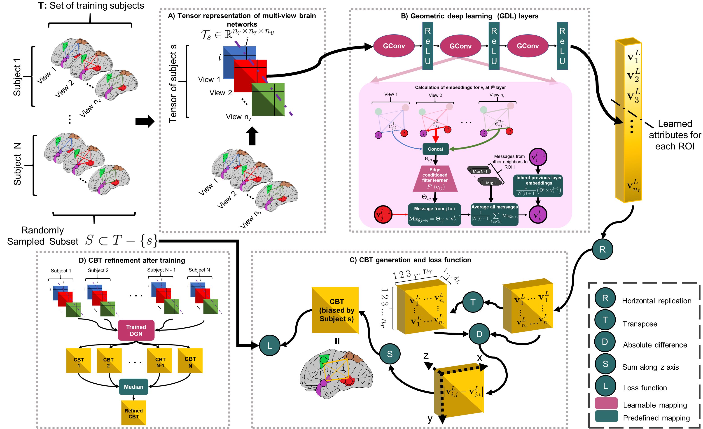
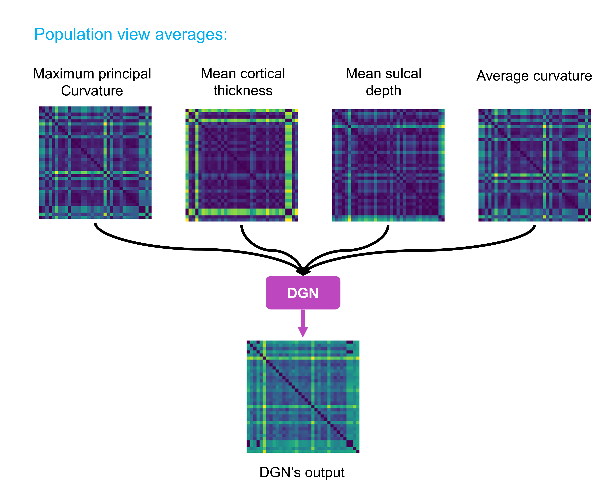

# Deep Graph Normalizer (DGN)
How to integrate a set of brain multi-graphs into a single graph?

Please contact mustafaburakgurbuz@gmail.com for inquiries. Thanks. 



# Introduction
This work is accepted at the MICCAI 2020 conference (early accept), Lima, Peru.

> **Deep Graph Normalizer: A Geometric Deep Learning Approach for Estimating Connectional Brain Templates**
>
> Mustafa Burak Gurbuz and Islem Rekik
>
> BASIRA Lab, Faculty of Computer and Informatics, Istanbul Technical University, Istanbul, Turkey
>
> **Abstract:** *A connectional brain template (CBT) is a normalized graph-based representation of a population of brain networks —also regarded as an average connectome. CBTs are powerful tools for creating representative maps of brain connectivity in typical and atypical populations. Particularly, estimating a well-centered and representative CBT for populations of multi-view brain networks (MVBN) is more challenging since these networks sit on complex manifolds and there is no easy way to fuse different heterogeneous network views. This problem remains unexplored with the exception of a few recent works rooted in the assumption that the relationship between connectomes are mostly linear. However, such an assumption fails to capture complex patterns and non-linear variation across individuals. Besides, existing methods are simply composed of sequential MVBN processing blocks without any feedback mechanism, leading to error accumulation. To address these issues, we propose Deep Graph Normalizer (DGN),the first geometric deep learning (GDL) architecture for normalizing a population of MVBNs by integrating them into a single connectional brain template. Our end-to-end DGN learns how to fuse multi-view brain networks while capturing non-linear patterns across subjects and preserving brain graph topological properties by capitalizing on graph convolutional neural networks. We also introduce a randomized weighted loss function which also acts as a regularizer to minimize the distance between the population of MVBNs and the estimated CBT, thereby enforcing its centeredness. We demonstrate that DGN significantly outperforms existing state-of-the-art methods on estimating CBTs on both small-scale and large-scale connectomic datasets in terms of both representativeness and discriminability (i.e., identifying distinctive connectivities fingerprinting each brain network population).*


## Code
This code was implemented using Python 3.8 (Anaconda) on Windows 10.
```diff
 You can edit config.py file to configure our DGN method according to your needs.
```

## Installation
### *Anaconda Installattion*
* Go to  https://www.anaconda.com/products/individual
* Download version for your system (We used Python 3.8  on 64bit Windows 10 )
* Install the platform
* Create a conda environment by typing:  ```conda create –n DGN pip python=3.8 ```

### *Dependency Installattion*
Copy and paste following commands to install all packages (CPU version)
```sh
$ conda activate DGN
$ conda install pytorch==1.4.0 torchvision==0.5.0 cpuonly -c pytorch
$ pip install scikit-learn
$ pip install matplotlib
$ pip install torch-scatter==latest+cpu -f https://pytorch-geometric.com/whl/torch-1.4.0.html
$ pip install torch-sparse==latest+cpu -f https://pytorch-geometric.com/whl/torch-1.4.0.html
$ pip install torch-cluster==latest+cpu -f https://pytorch-geometric.com/whl/torch-1.4.0.html
$ pip install torch-spline-conv==latest+cpu -f https://pytorch-geometric.com/whl/torch-1.4.0.html
$ pip install torch-geometric
```
This is all for CPU installation, please visit (optional) PyTorch-Geometric’s web page (https://pytorch-geometric.readthedocs.io/en/latest/notes/installation.html) for description on installing GPU version. Code will check the version of dependencies and availability of GPU. If everything is configured correctly, it will utilize GPU automatically.

## Data format
In case you want to use DGN on your multiview networks, we represent each multiview brain network with a stacked symmetrical connectivity matrices. Therefore our model expects you to provide a path of numpy array saved as a binary file in NumPy .npy format with shape [#Subjects, #Nodes, #Nodes, #Views]. For our case network nodes were regions of interest in the brain, however, any type of node is a valid input. If your networks are single view, you can simply set #Views to 1. Also, you can run DGN on a simulated dataset by setting ```Dataset = 'S' ``` at config.py file.  

## Run DGN
To run our code, open up a terminal at DGN’s directory and type in
```sh
$ conda activate DGN & python main.py
```
#####  You may edit config.py to tune hyperparameters, configure training or supply your own dataset.

## Components of DGN’s Code
| Component | Content |
| ------ | ------ |
| config.py | Includes hyperparameter and other options. You may modify it according to your needs. |
| model.py | Implementation of the model. |
| main.py| Driver code that import variables from config.py and trains DGN (cross-validation).  |
| helper.py| Includes some helper functions |
| cbts and model params/ | Includes model parameters and the estimated CBTs  for the datasets used on the paper.   |
| simulated dataset/example.py | A simulated dataset that shows the required data format. |
| output/<model name>/ | After the training, this directory includes model parameters, final CBT, and subject biased CBTs for each fold. |
| temp/ | Includes interim model parameters that are saved for each 10 epoch. Deleted after the training.  |
#####  output/<model name>/ and temp/ directories created by main.py
  
## Example Result  

The figure demonstrates an example of output for a population of 37 subjects where each subject has 4 views (each represented by 35 by 35 matrix). Our code takes in a numpy array of size [37, 35, 35, 4] and outputs a 35 by 35 matrix.


## YouTube videos to install and run the code and understand how DGN works

To install and run DGN, check the following YouTube video: 

https://youtu.be/8tDNYV0NYpY

To learn about how DGN works, check the following YouTube video: 

https://youtu.be/Q_WLY2ZNxRk

## Relevant References
Fey, M. & Lenssen, J. E. Fast graph representation learning with PyTorch Geometric. In ICLR Workshop on Representation Learning on Graphs and Manifolds (2019).

Adam Paszke, Sam Gross, Soumith Chintala, Gregory Chanan, Edward Yang, Zachary DeVito, Zeming Lin, Alban Desmaison, Luca Antiga, and Adam Lerer. Automatic differentiation in pytorch. In NIPS-W, 2017.

## DGN on arXiv

https://arxiv.org/abs/2012.14131

## Please cite the following paper when using DGN
```latex
  @inproceedings{gurbuzrekik2020,
    title={Deep Graph Normalizer: A Geometric Deep Learning Approach for Estimating Connectional Brain Templates},
    author={Gurbuz, Mustafa Burak and Rekik, Islem},
    booktitle={Medical Image Computing and Computer Assisted Intervention},
    year={2020},
    organization={Springer}
  }
```
